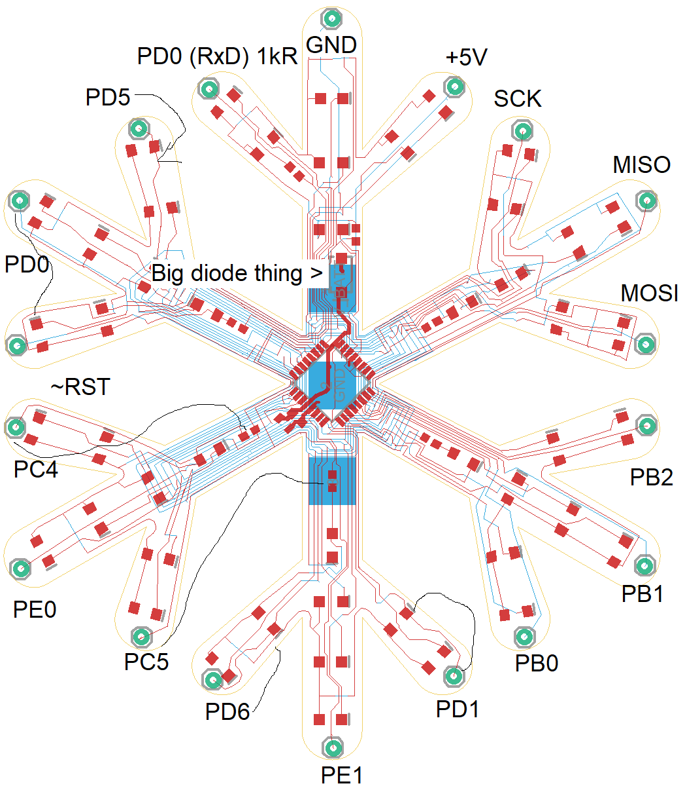
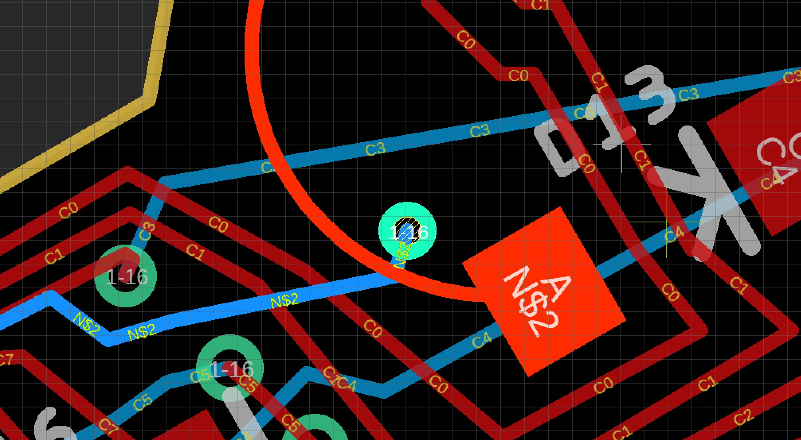
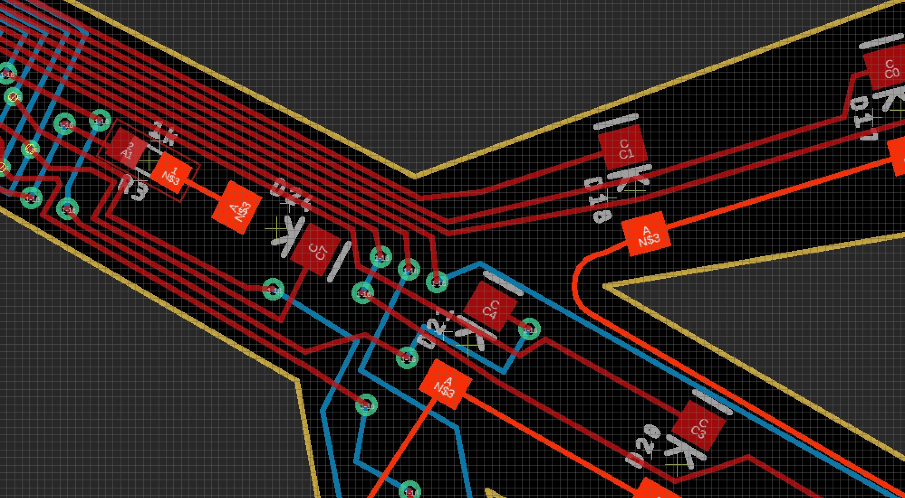

# snowflake
 
# Welcome
Welcome to the 2021 Christmas card. This one’s a snowflake. Put a CR2032 battery in the back (flat side up, but don’t worry there’s a diode so putting it in backwards won’t hurt – it won’t do anything, but it won’t hurt either :P), and it should start twinkling. It’ll go on forever until the battery runs out, which I hope will take a few weeks at least.

# Design
There’s not enough pins to give every LED on the snowflake its own pin on the MCU, so they’re matrixed. The LED `+V` pins on each spire are controlled by a single pin on the MCU, so 6 bits total, `PC0-5`. Then, each LED in the same spot on each spire’s GND pin is controlled by a pin on the MCU, for a total of 8 bits, `PD0-7`. So, to turn on `LED0` on `spire 0`, you’d output high on `PC0` and output low on `PD0`. To turn the same LED on spire 1 on, it would be the same but you would output low on `PD1` instead.

Theoretically this means you can only have multiple different LEDs on the same spire illuminated if all the other spires are off, or the LED in the same spot will be lit on those spires as well. In practice, the firmware ignores those constraints and just picks two LEDs at random to twinkle, because it turns out the visual effect is interesting so whatever.

To get the snowflake shaped board, I looked around for snowflake SVG images, and found the one from Wikipedia <link>. I then wrote a partial, hacky, SVG path parser and converted that to the corresponding Eagle board outline XML primitives. (Thankfully they’re the same primitives, so it just needed minor transformations. The biggest pain there was understanding the terrible SVG path format. You can really tell that specification was inherited from an old software project that was donated and came from an era with far more limited processing power. Also, as an aside, with that many curves in the board outline, Eagle’s default assisted routing is really, REALLY slow to route, which is why the routing looks like someone drew it with a crayon. Because I did. An unassisted software-crayon.)

The firmware itself is pretty simple. It software-PWMs the LEDs, and picks one or two to twinkle on and off at random. To save power, the MCU runs on the low-speed 128kHZ clock, which limits the software PWM to 2 LEDs. I’m sure you could do more at once with some optimization of the C code, but that’s already pretty optimized compared to the original version, and the matrixed LEDs means that more than 2 are frequently illuminated anyway, so I think it’s fine. But, it’s all open source, so ...

I don’t know how long the battery will last, but given the low-power clock is supposed to only take ~ 45 uA, probably at least as long as it takes you to throw out the Christmas tree, but probably not long enough to make it to next Christmas? Shrug.

# Other uses
Aside from being an interesting Christmas card ornament, it’s designed to be somewhat usable as a general-purpose Arduino-compatible AVR microcontroller. At every tip are standard 0.1 mm header holes, routed to various useful pins from the MCU.

## Programming
The default firmware doesn’t have a bootloader (which wouldn’t be very useful at the 128kHz clock speed anyway), but using something like the Sparkfun AVR Programmer, or just another Arduino, you can upload your own code. (Everything is 5 volt tolerant [by virtue of there being nothing on the board but LEDs :-D], so no worries about hooking it up directly to either.) Follow the hookup guide below, but be careful: there is no reverse-current protection between `V+` and `GND`:
 
One connected, the easiest way to program is to install Arduino and then run something like:

```Batchfile
"c:\Program Files (x86)\Arduino\hardware\tools\avr\bin\avrdude.exe" -C "C:\Program Files (x86)\Arduino\hardware\tools\avr\etc\avrdude.conf" -c usbtiny -p atmega328pb -U lfuse:w:0x62:m -B 250
```

to set the fuses back to the default 1 MHz clock (that’s the `0x62`), then

```Batchfile
"c:\Program Files (x86)\Arduino\hardware\tools\avr\bin\avrdude.exe" -C "C:\Program Files (x86)\Arduino\hardware\tools\avr\etc\avrdude.conf" -c usbtiny -p atmega328pb -U flash:w:sketch_dec20b.ino.hex
```

to upload your code (replacing the file with whatever your sketch is).

(As an aside, if you want to put the original snowflake firmware back on the board, the 128kHz clock fuse setting is `0xe3`.)

Note also that Arduino compiles into something like `C:\Users\Gabe\AppData\Local\Temp\arduino_build_696623`, so you can do

```
dir arduino_build* /od-
```

to find the directory of your most recently compiled sketch when you’re in the Temp directory, in order to get to the folder of your compiled sketch.

This all is written for Windows, but you can find the location on your platform by going to the Arduino preferences and clicking the *Show verbose output* options and observing the path.

## MiniCore
The snowflake has an **ATMega328PB** MCU, which is almost but not quite the same as the one in the Arduino Uno (lower power among other things). The **MiniCore** project supports this chip as well the internal oscillator (Uno has an external crystal). So, the easiest way to use the snowflake for something else is to install that project into Arduino, at which point you can do like it says and either continue using the programmer, or burn its bootloader to the chip and hook up a USB-serial converter to the appropriate pins. (Set the fuse back to 1MHz as above first.)



Which, speaking of:

## Exposed Pins
As much as possible I’ve routed out useful pins to the headers on the tips of the snowflake. These connections look a bit random but were chosen to expose the most useful pins 1st, and then for ease of routing 😊. Note that several pins have lines drawn from them to either LEDs or resistors (**LEDs**: `PD5, PD6, PD1`, **resistors:** `PC4, PC5`). These are shared with the matrixed LEDs. All LED pins are shared with every LED in that spot on each spire, and the resistors control all the LEDs on those two spires. Just keep that in mind when using these pins, as the current draw by the LEDs could cause unexpected signal issues.

Interesting exposed pin configurations:

* **UART0 Rx/Tx**: `PD0/PD1` (as well as 1k resistor limited Rx)
* `PB0-2`: This whole spire isn’t shared with any LEDs!
* **SPI0**: `MOSI, MISO, SCLK`, and `PB2 (~SS)` (and isn’t shared with LEDs either)
* **I2C0**: `PC4 (SDA), PC5 (SCL)`
* **I2C1**: `PE0 (SDA), PE1 (SCL)`, and isn’t shared with anything!
* `PD6`: Analog in 0

In other words, you’ve got a SPI and I2C bus both free from any LED interference, as well as a few more pins (`PB0 and PB1`).

And, if you don’t mind not using the LEDs, you can also use the hardware UART0, another I2C bus, and an analog input.

## Errata
Too late in the design process, I discovered I had used the wrong sized LED footprint, and the only ones in stock at JLCPCB assembly were white LEDs. Surprisingly, these light at the 3V of the CR2032 battery, but they are rather dim when placed inline with the 1k resistors. To solve that, you can either short out the resistors with a soldering iron, or you can hook up a 5 V power supply to the GND/5V pins on the snowflake. Sorry! 😊 (You could also stack two batteries on top of one another and hook that up, for ~6 V, which would be bright too, but won’t fit in the battery holder sadly.)

You’ve probably noticed from the bodge wire that there are a few issues with the design as is. The main one is that two of the spires’ LEDs aren’t connected, because of routing errors in the PCB.





The other is that I put a 1K resistor on the UART Rx (into MCU) line, so that you can safely feed signals from a 5V USB-serial converter even if the board is powered at 3.3V (by virtue of the input protection diodes). However, I didn’t think about the fact that the more common scenario is that it’s powered by a USB-serial adapter which supplies raw USB power (~5V) but inputs and outputs 3.3V. In that case, the Tx line is the one that needs protection and there isn’t any. So, you’d have to add your own. That’s probablSy not a big hassle given you’ll already have to add a pull-up resistor and capacitor or a RST button/wire if you’re going to use serial programming anyway, but just something to be aware of.
